# DeepDIG: An Infrared Small Target Detection Method

[](https://2026.acmmm.org/)
[](LICENSE)
[](https://pytorch.org/)

> **Anonymous Submission for ACM MM 2026**
> 
> Implementation of the paper: **"DeepDIG: Deep Background Alignment Helps See Infrared Small Target Better"**

## Introduction

**DeepDIG** is a robust multi-frame Infrared Small Target (IRST) detection framework designed to handle **large background motions**—a scenario where existing methods (either relying on static background assumptions or aligning background via optical flow and handcrafted local descriptor) often fail.

The core innovations include:
1.  **Deep Background Alignment (DBA):** Leverages deep local descriptors (adapted from XFeat) for robust frame registration.
2.  **Temporal Accumulated Dynamic Convolution (TADC):** A motion-conditioned mechanism to suppress alignment errors and enhance target signals.
3.  **Motion-Guided Adaptive Gating (MAG):** adaptively fuses spatial and temporal features based on motion confidence.
4.  **LMIRSTD Dataset:** A new challenging dataset comprising 12k frames with significant background motion.


<p align="center">
  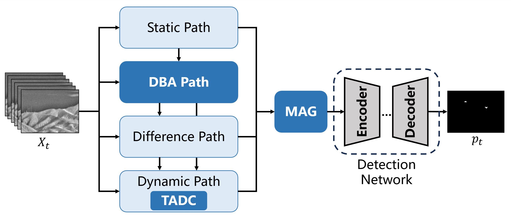
  <br>
  <em>Figure 1: Overview of the proposed DeepDIG.</em>
</p>

<p align="center">
  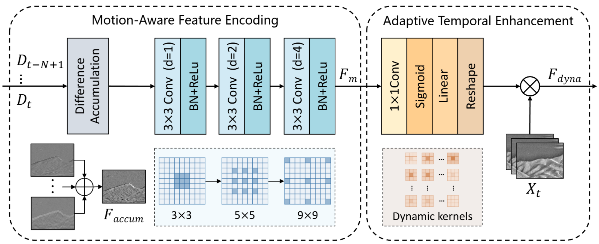
  <br>
  <em>Figure 2: Illustration of the proposed TADC mechanism.</em>
</p>

<p align="center">
  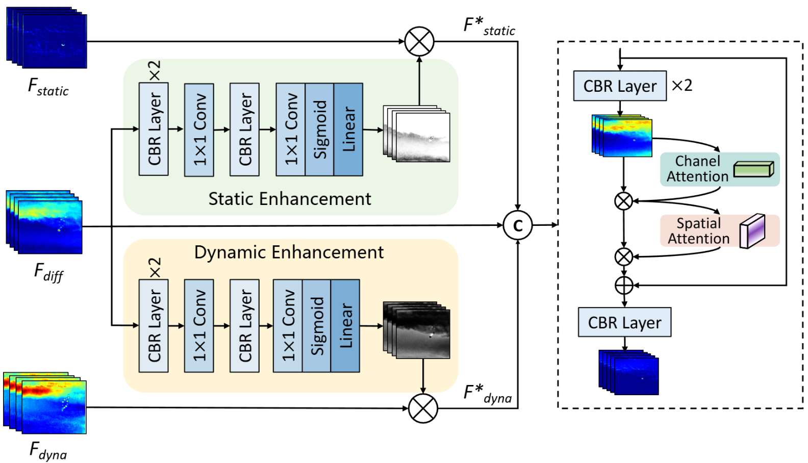
  <br>
  <em>Figure 3: Illustration of the proposed MAG strategy.</em>
</p>


## Datasets
We introduce a new Large-motion Multi-frame IRST Detection (LMIRSTD) dataset, specifically designed to evaluate multi-frame methods under pronounced background motion. LMIRSTD comprises 60 real-world infrared video sequences, each containing 200 frames at a resolution of 640×512. The dataset spans diverse natural and urban scenes across different seasons and illumination conditions (daytime and nighttime), and features strong background motion induced by camera translation and jitter. Moreover, LMIRSTD exhibits a balanced distribution of target scales, with large ([9², ∞)), medium ([5², 9²)), and small ([1², 5²)) targets accounting for 17.4%, 50.6%, and 32%, respectively. By explicitly emphasizing large background motion and long-term temporal dynamics, LMIRSTD provides a more realistic and challenging benchmark for multi-frame IRST detection. The key characteristics of all datasets used in this work are summarized in Table 1. The dataset can be downloaded [here](https://drive.google.com/drive/folders/1tv9GhDs2jT7N_RRtqT8z2lzg-IpnqTfL?usp=sharing).


<p align="center">
  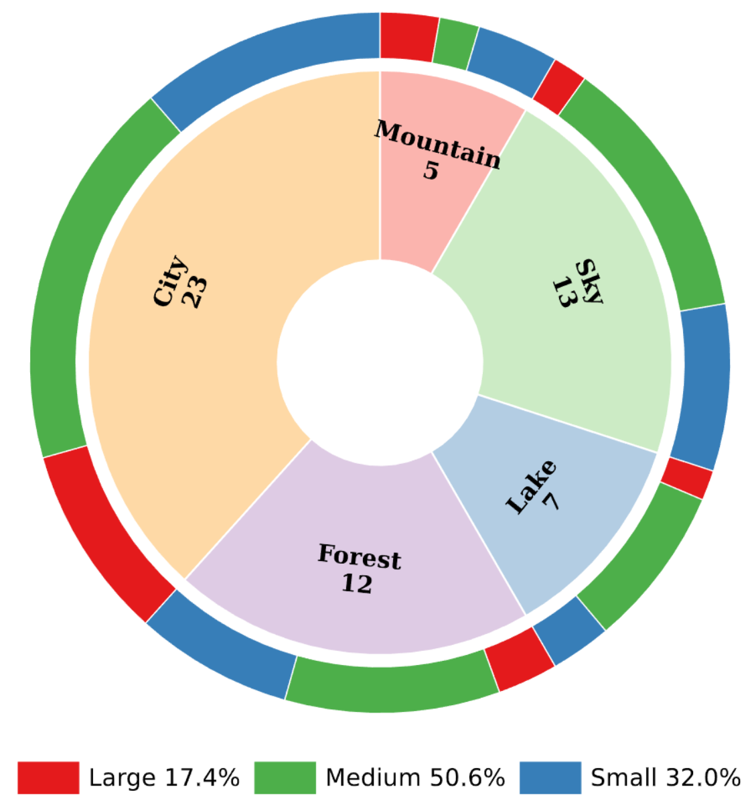
  <br>
  <em>Figure 4: The scenarios distribution of our Dataset.</em>
</p>

<p align="center">
  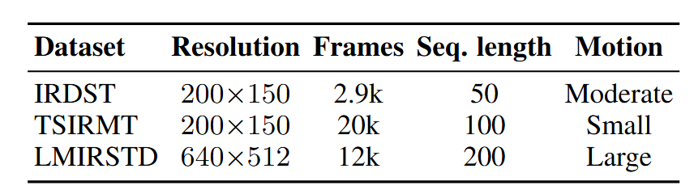
  <br>
  <em>Table 1: Details about LMIRSTD Dataset.</em>
</p>

<p align="center">
<table style="border-collapse: collapse; border: none;">
<tr style="border: none;">
<td align="center" style="border: none;">
  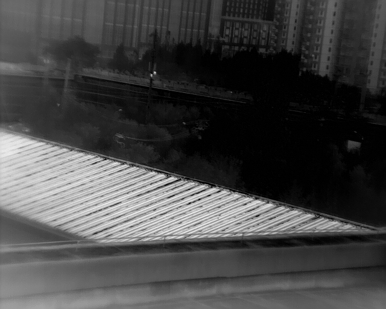
  <br><em>urban</em>
</td>
<td align="center" style="border: none;">
  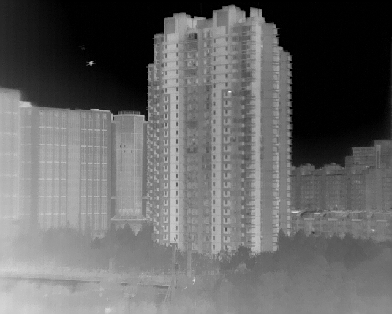
  <br><em>urban</em>
</td>
<td align="center" style="border: none;">
  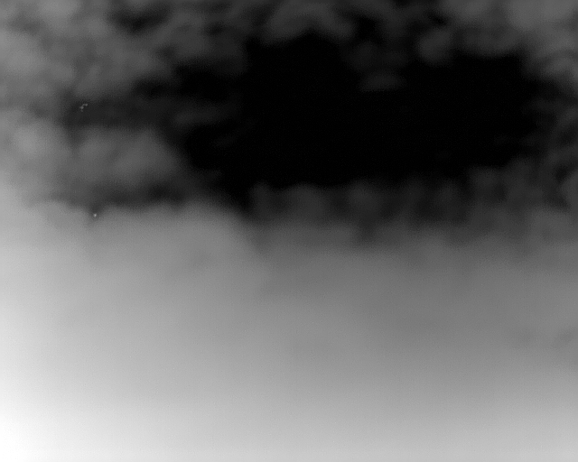
  <br><em>sky</em>
</td>
</tr>
<tr style="border: none;">
<td align="center" style="border: none;">
  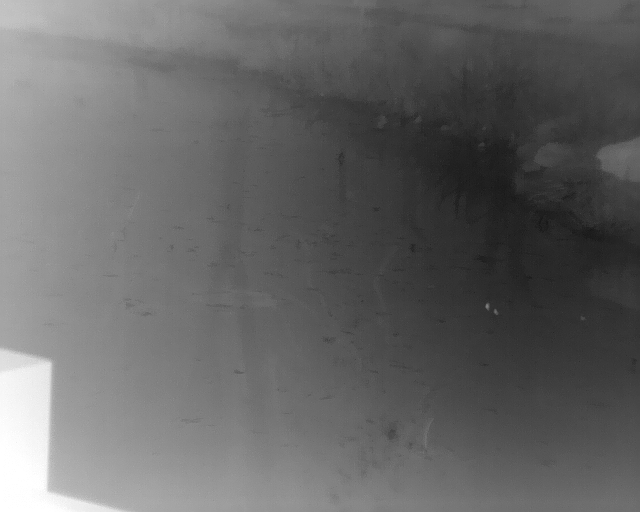
  <br><em>lake</em>
</td>
<td align="center" style="border: none;">
  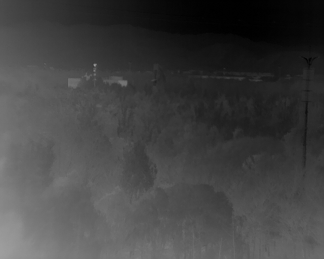
  <br><em>forest</em>
</td>
<td align="center" style="border: none;">
  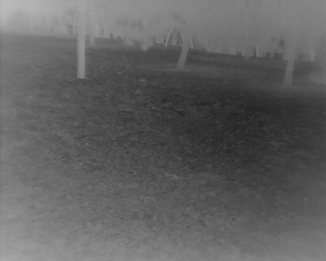
  <br><em>mountain</em>
</td>
</tr>
</table>
<br>
<em>Figure 5: Illustration of samples from our constructed LMIRSTD Dataset.</em>
<br>
</p>


<p align="center">
  
  
  <br>
  <em>Figure 6: Moving targets and their detection results</em>
</p>


<br>

## Running (Inference)

### Download Weights
Pre-trained model weights can be downloaded [here](https://drive.google.com/drive/folders/1YF7dkfp9zl7Ny9WdfzAv1QAsHZgiKhSw?usp=sharing). Please place them in the `./weights` directory.

### Environment Setup
Prepare environment:
```bash
conda create -n DeepDIG python=3.10
conda activate DeepDIG
pip install -r requirements.txt
```

Run evaluation/inference using `test_deepdig.py`. Below are example commands for the three supported datasets.

```bash
# TSIRMT
python test_deepdig.py \
  --ckpt ./weights/TSIRMT_IoU_0.7317.pth \
  --root ./dataset \
  --dataset TSIRMT \
  --save_pred

# IRDST
python test_deepdig.py \
  --ckpt ./weights/IRDST_IoU_0.6565.pth \
  --root ./dataset \
  --dataset IRDST \
  --save_pred

# LMIRSTD
python test_deepdig.py \
  --ckpt ./weights/LMIRSTD_IoU_0.7624.pth \
  --root ./dataset \
  --dataset LMIRSTD \
  --save_pred
```

Key arguments:

- `--ckpt`: path to model checkpoint (`.pth`)
- `--root`: dataset root directory (should contain the dataset folder `IRDST/TSIRMT/LMIRSTD`)
- `--dataset`: dataset name, one of `IRDST`, `TSIRMT`, `LMIRSTD`
- `--save_pred`: save binarized prediction results to the output directory

## Main Results
DeepDIG achieves state-of-the-art performance on **IRDST**, **TSIRMT**, and the proposed **LMIRSTD** datasets.
**Note:** **Bold** indicates the best result, <u>underline</u> indicates the second-best result. P<sub>d</sub> (%), F<sub>a</sub> (×10⁻⁶), IoU (%), nIoU (%), F<sub>1</sub> (%).

  <p align="center">
  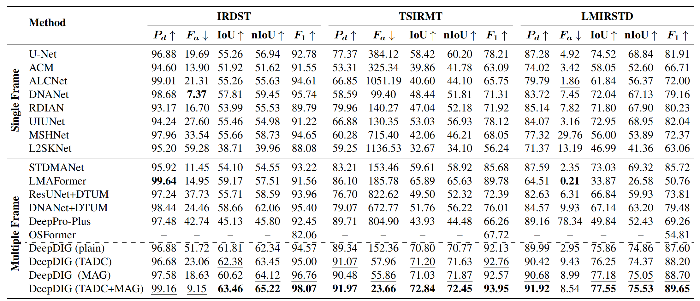
  <br>
  <em>Table 2: Quatitative evaluation on three datasets.</em>
</p>

<p align="center">
  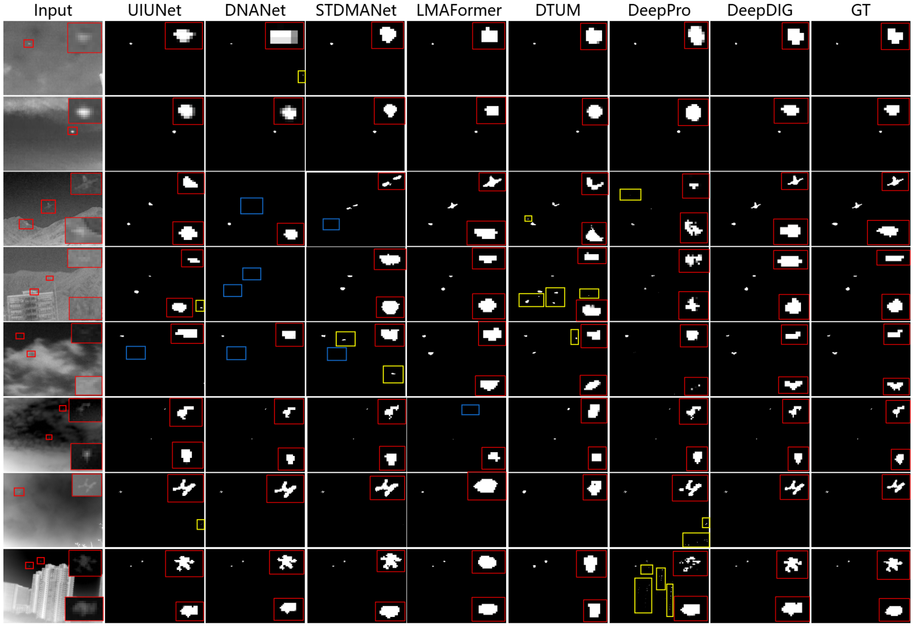
  <br>
  <em>Figure 7: Qualitative comparison on several infrared images.</em>
</p>

### Requirements

* Linux (tested on Ubuntu 22.04)
* Python 3.8+
* PyTorch 2.4.1+ / CUDA 12.1
