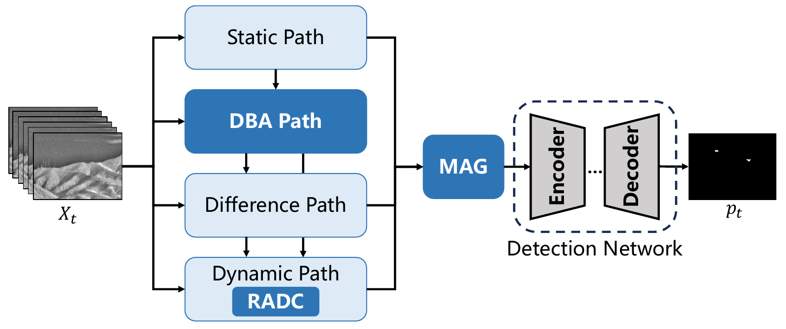
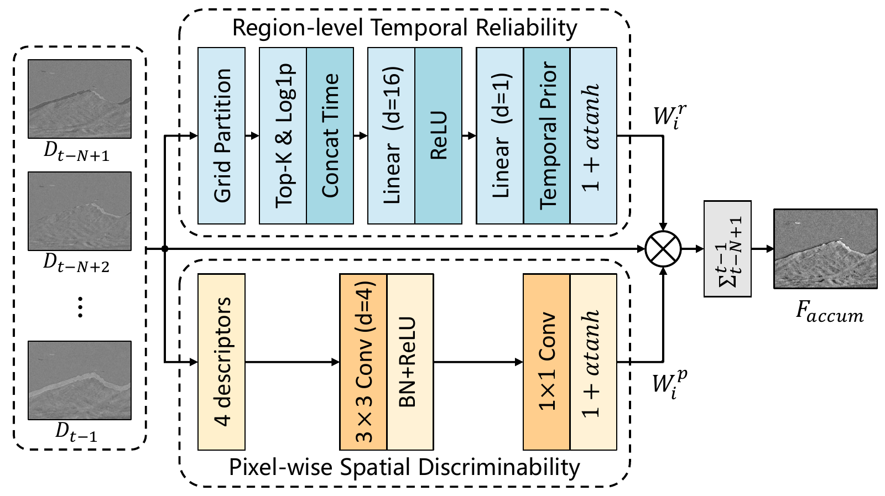
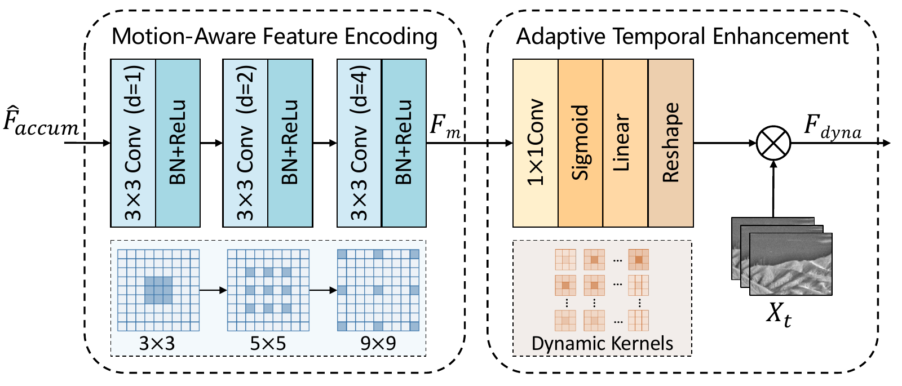
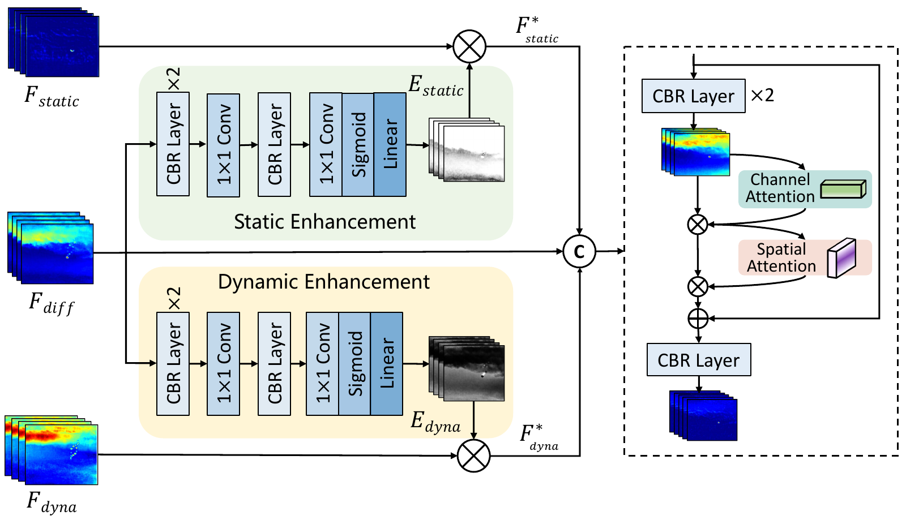
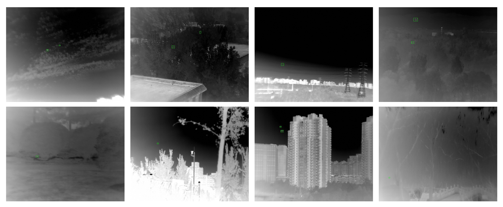
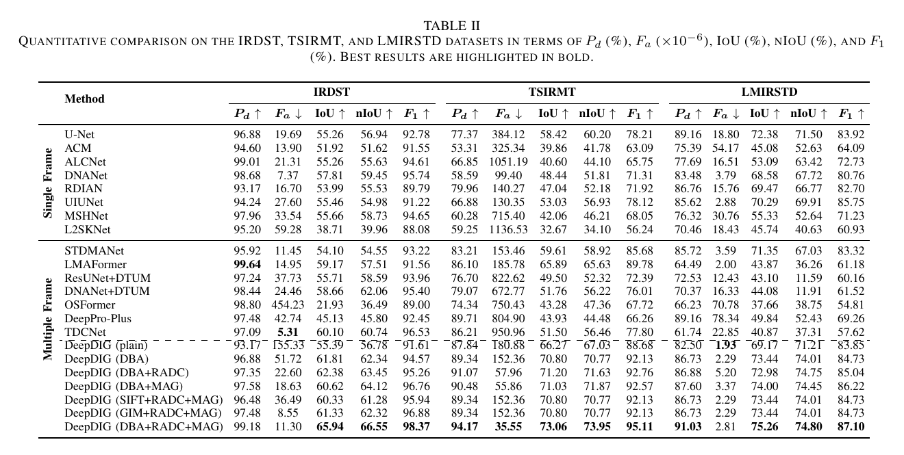
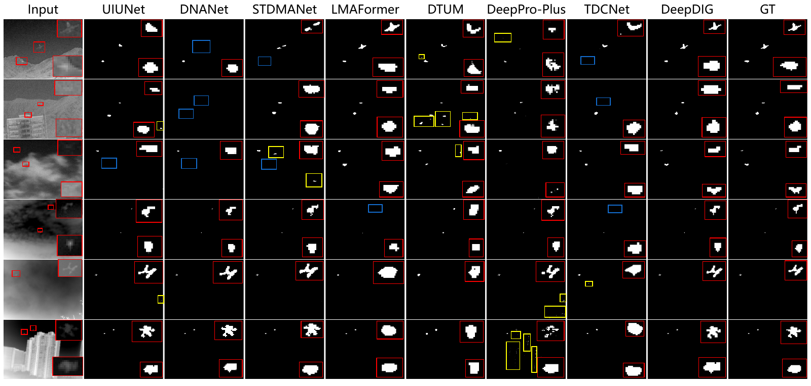

<h1 align="center">DeepDIG: Deep Background Alignment Helps See Infrared Small Target Better</h1>

<p align="center">Project page for the manuscript prepared for <strong>IEEE Transactions on Multimedia (TMM)</strong>.</p>

DeepDIG detects small infrared targets in video sequences with significant camera-induced background motion. The current manuscript describes three components:

- **Deep Background Alignment (DBA):** Reuses spatial features to extract local descriptors and align frames.
- **Reliability-Aware Dynamic Convolution (RADC):** Combines Reliability-Aware Temporal Aggregation (RATA) with Content-Adaptive Dynamic Convolution (CADC) to reduce alignment artifacts and enhance motion cues.
- **Motion-guided Adaptive Gating (MAG):** Fuses spatial and temporal features using motion guidance.

The repository currently contains an earlier inference implementation. Its temporal module is named TADC and does not implement the full RATA and CADC design described in the TMM manuscript. The manuscript results below are reported results, not verified outputs of the currently published code and checkpoints. Updated implementation and checkpoints are needed for exact reproduction.

## Method

<p align="center">
  
</p>

The aligned sequence is processed by static, difference, and dynamic paths before MAG fuses their features for detection.

<table align="center">
  <tr>
    <th align="center">Reliability-aware aggregation</th>
    <th align="center">Content-adaptive convolution</th>
  </tr>
  <tr>
    <td align="center"></td>
    <td align="center"></td>
  </tr>
</table>

<p align="center">
  
</p>

## LMIRSTD Dataset

LMIRSTD contains **60 infrared video sequences**: 45 for training and 15 for testing. Each sequence has 200 frames at **640 x 512** resolution, for 12,000 frames in total. It includes dim targets and pronounced background motion across sky, urban, forest, mountain, and lake scenes. Its mean signal-to-clutter ratio (SCR) is 2.25 in the current manuscript.

<p align="center">
  
</p>

<table align="center">
  <thead>
    <tr><th>Dataset</th><th>Mean SCR</th><th>Background motion</th></tr>
  </thead>
  <tbody>
    <tr><td>IRDST</td><td align="center">6.70</td><td>Large</td></tr>
    <tr><td>TSIRMT</td><td align="center">3.04</td><td>Mild</td></tr>
    <tr><td>LMIRSTD</td><td align="center">2.25</td><td>Large</td></tr>
  </tbody>
</table>

The LMIRSTD dataset is available from the [dataset folder](https://drive.google.com/drive/folders/1tv9GhDs2jT7N_RRtqT8z2lzg-IpnqTfL?usp=sharing).

## Manuscript Results

The full quantitative comparison is reproduced directly from Table II of the current TMM manuscript. `Fa` is reported in units of `10^-6`; all other metrics are percentages, and the best results are shown in **bold**.

<p align="center">
  
</p>

<!--
<details>
<summary>View the numerical results as a table</summary>

<div align="center">
<table>
  <thead>
    <tr>
      <th rowspan="2">Type</th>
      <th rowspan="2">Method</th>
      <th colspan="5">IRDST</th>
      <th colspan="5">TSIRMT</th>
      <th colspan="5">LMIRSTD</th>
    </tr>
    <tr>
      <th>Pd ↑</th><th>Fa ↓</th><th>IoU ↑</th><th>nIoU ↑</th><th>F1 ↑</th>
      <th>Pd ↑</th><th>Fa ↓</th><th>IoU ↑</th><th>nIoU ↑</th><th>F1 ↑</th>
      <th>Pd ↑</th><th>Fa ↓</th><th>IoU ↑</th><th>nIoU ↑</th><th>F1 ↑</th>
    </tr>
  </thead>
  <tbody>
    <tr><td rowspan="8">Single frame</td><td>U-Net</td><td>96.88</td><td>19.69</td><td>55.26</td><td>56.94</td><td>92.78</td><td>77.37</td><td>384.12</td><td>58.42</td><td>60.20</td><td>78.21</td><td>87.28</td><td>4.92</td><td>74.52</td><td>68.84</td><td>81.91</td></tr>
    <tr><td>ACM</td><td>94.60</td><td>13.90</td><td>51.92</td><td>51.62</td><td>91.55</td><td>53.31</td><td>325.34</td><td>39.86</td><td>41.78</td><td>63.09</td><td>74.02</td><td>3.42</td><td>58.05</td><td>52.60</td><td>66.71</td></tr>
    <tr><td>ALCNet</td><td>99.01</td><td>21.31</td><td>55.26</td><td>55.63</td><td>94.61</td><td>66.85</td><td>1051.19</td><td>40.60</td><td>44.10</td><td>65.75</td><td>79.79</td><td>1.86</td><td>61.84</td><td>56.37</td><td>72.00</td></tr>
    <tr><td>DNANet</td><td>98.68</td><td><strong>7.37</strong></td><td>57.81</td><td>59.45</td><td>95.74</td><td>58.59</td><td>99.40</td><td>48.44</td><td>51.81</td><td>71.31</td><td>83.72</td><td>7.45</td><td>72.04</td><td>67.13</td><td>79.16</td></tr>
    <tr><td>RDIAN</td><td>93.17</td><td>16.70</td><td>53.99</td><td>55.53</td><td>89.79</td><td>79.96</td><td>140.27</td><td>47.04</td><td>52.18</td><td>71.92</td><td>85.14</td><td>7.82</td><td>71.80</td><td>67.90</td><td>80.23</td></tr>
    <tr><td>UIUNet</td><td>94.24</td><td>27.60</td><td>55.46</td><td>54.98</td><td>91.22</td><td>66.88</td><td>130.35</td><td>53.03</td><td>56.93</td><td>78.12</td><td>84.07</td><td>3.16</td><td>72.95</td><td>68.95</td><td>82.04</td></tr>
    <tr><td>MSHNet</td><td>97.96</td><td>33.54</td><td>55.66</td><td>58.73</td><td>94.65</td><td>60.28</td><td>715.40</td><td>42.06</td><td>46.21</td><td>68.05</td><td>77.32</td><td>29.76</td><td>56.00</td><td>53.89</td><td>72.37</td></tr>
    <tr><td>L2SKNet</td><td>95.20</td><td>59.28</td><td>38.71</td><td>39.96</td><td>88.08</td><td>59.25</td><td>1136.53</td><td>32.67</td><td>34.10</td><td>56.24</td><td>71.37</td><td>13.19</td><td>46.99</td><td>41.36</td><td>63.06</td></tr>
    <tr><td rowspan="7">Multiple frame</td><td>STDMANet</td><td>95.92</td><td>11.45</td><td>54.10</td><td>54.55</td><td>93.22</td><td>83.21</td><td>153.46</td><td>59.61</td><td>58.92</td><td>85.68</td><td>87.59</td><td>2.35</td><td>73.03</td><td>69.32</td><td>85.72</td></tr>
    <tr><td>LMAFormer</td><td><strong>99.64</strong></td><td>14.95</td><td>59.17</td><td>57.51</td><td>91.56</td><td>86.10</td><td>185.78</td><td>65.89</td><td>65.63</td><td>89.78</td><td>64.51</td><td><strong>0.21</strong></td><td>33.87</td><td>26.58</td><td>50.76</td></tr>
    <tr><td>ResUNet+DTUM</td><td>97.24</td><td>37.73</td><td>55.71</td><td>58.59</td><td>93.96</td><td>76.70</td><td>822.62</td><td>49.50</td><td>52.32</td><td>72.39</td><td>82.63</td><td>6.31</td><td>66.84</td><td>59.93</td><td>73.81</td></tr>
    <tr><td>DNANet+DTUM</td><td>98.44</td><td>24.46</td><td>58.66</td><td>62.06</td><td>95.40</td><td>79.07</td><td>672.77</td><td>51.76</td><td>56.22</td><td>76.01</td><td>84.57</td><td>9.93</td><td>67.14</td><td>63.20</td><td>79.48</td></tr>
    <tr><td>DeepPro-Plus</td><td>97.48</td><td>42.74</td><td>45.13</td><td>45.80</td><td>92.45</td><td>89.71</td><td>804.90</td><td>43.93</td><td>44.48</td><td>66.26</td><td>89.16</td><td>78.34</td><td>49.84</td><td>52.43</td><td>69.26</td></tr>
    <tr><td>OSFormer</td><td>–</td><td>–</td><td>–</td><td>–</td><td>82.06</td><td>–</td><td>–</td><td>–</td><td>–</td><td>67.72</td><td>–</td><td>–</td><td>–</td><td>–</td><td>54.81</td></tr>
    <tr><td><strong>DeepDIG (ours)</strong></td><td>99.18</td><td>11.30</td><td><strong>65.94</strong></td><td><strong>66.55</strong></td><td><strong>98.37</strong></td><td><strong>94.17</strong></td><td><strong>35.55</strong></td><td><strong>73.06</strong></td><td><strong>73.95</strong></td><td><strong>95.11</strong></td><td><strong>91.03</strong></td><td>2.81</td><td><strong>75.26</strong></td><td><strong>74.80</strong></td><td><strong>87.10</strong></td></tr>
  </tbody>
</table>
</div>

</details>
-->

The manuscript reports **9.15 FPS**, **15.21M parameters**, and **33.14 GFLOPs** for the full DeepDIG pipeline at 256 x 256 input resolution on an NVIDIA RTX 4090D. FPS includes background alignment and inference.

<p align="center">
  
</p>

## Inference With the Currently Published Code

The [checkpoint folder](https://drive.google.com/drive/folders/1YF7dkfp9zl7Ny9WdfzAv1QAsHZgiKhSw?usp=sharing) was published with the earlier implementation. Use checkpoints that match the code version in this repository. The manuscript numbers above should not be assumed reproducible with those checkpoints.

Tested environment: Ubuntu 22.04, Python 3.10, PyTorch 2.4.1, and CUDA 12.1. Install a compatible PyTorch build first, then install the remaining dependencies:

```bash
conda create -n deepdig python=3.10
conda activate deepdig
pip install torch==2.4.1 --index-url https://download.pytorch.org/whl/cu121
pip install -r requirements.txt
```

Place checkpoints in `weights/`. The dataset root should contain `IRDST/`, `TSIRMT/`, or `LMIRSTD/`. For example:

```bash
python test_deepdig.py \
  --ckpt ./weights/YOUR_CHECKPOINT.pth \
  --root ./dataset \
  --dataset LMIRSTD \
  --save_pred
```

Replace `YOUR_CHECKPOINT.pth` with the actual checkpoint name. The script also supports `IRDST` and `TSIRMT` through `--dataset`. By default, predictions are saved under `result/<dataset>/`.
